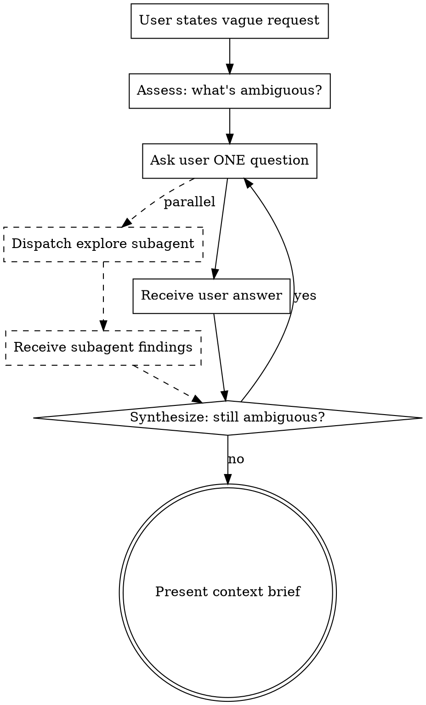

# Clarification Through Iterative Discovery

Narrows vague user requests into well-defined work scopes. Runs questions and code exploration in parallel to bring the user to a state where they can plan sharply.

## Core Principle

Ambiguity does not resolve in one pass. Multiple rounds of questions and code exploration intersect, gradually sharpening the picture. The purpose of this skill is not "writing code" — it is making "what the user wants" and "what state the codebase is in" vivid and clear.

## Hard Gates

1. **One question per message.** Never bundle multiple questions into a single message.
2. **Always use subagents.** While conversing with the user, dispatch subagents to explore the codebase in response to the user's answers.
3. **Do not start implementation until you can say "this is clear enough."** Understanding must be complete at the codebase level.
4. **Every question must narrow scope.** Do not repeat questions at the same level of ambiguity.
5. **Never dump raw code exploration results on the user.** Summarize findings in the context of the user's question.

## When To Use

- The user says "I want to…" but the scope is unclear
- The request is vague enough that implementation could go in multiple directions
- The user themselves hasn't fully articulated what they want
- There's a risk of clashing with existing codebase structure, so exploration is needed

## When NOT To Use

- The request is already specific and clear (proceed to implementation or plan skill)
- The scope is obvious, like a simple bug fix or config change
- The user explicitly says "don't ask questions, just do it"

## The Two-Track Process

### Track 1: User Q&A (Ambiguity Resolution)

Ask the user questions to resolve ambiguity.

**Question principles:**

- One question per message
- Offer choices when possible (A/B/C)
- When a new ambiguity emerges from an answer, drill into it in the next question
- Ask "which case?" rather than "why?" — draw out concrete scenarios, not abstract intent
- If an answer contradicts a previous one, flag it immediately and realign

**Question sequence guide:**

1. **Purpose**: "What is the end goal of this work?" (what they want to achieve)
2. **Scope**: "What's included and what's excluded?" (draw boundaries)
3. **Constraints**: "Are there existing constraints that affect this?" (time, compatibility, dependencies)
4. **Success criteria**: "What should the state look like when this is done?" (verifiable outcome)
5. **Priority**: "If there are multiple paths, what matters most?" (trade-offs)

After each question, briefly update "what we've established so far."

### Track 2: Codebase Exploration (Technical Context)

Use subagents to explore the codebase. Run in parallel with user Q&A.

**How to dispatch exploration:**

Immediately after asking the user a question, launch a subagent via the Agent tool. The goal is to make the user fully understand how the work plays out in the codebase. The subagent investigates:

- Related file structure and naming conventions
- Existing implementation patterns (error handling, state management, data flow)
- Dependencies and interface boundaries
- Recent change history (relevant commits)
- Test coverage status

**Subagent prompt template:**

```
subagent_type: Explore
description: "Explore [topic] codebase"
prompt: |
  The user has requested [summarized request].

  Investigate and report on:
  1. Related files and the role of each
  2. Existing implementation patterns (is something similar already in place?)
  3. Boundary areas this work is likely to affect
  4. Recent related changes
  5. Existing test state

  Report only key findings concisely.
  Do not dump entire file contents.
```

**Processing subagent results:**

When the subagent returns findings:
1. Cross-validate against the user's answers
2. If technical constraints unknown to the user are discovered, reflect them in the next question
3. If a conflict with existing code is likely, notify the user

## Putting It Together: The Loop



**Each cycle:**

1. Receive the user's answer
2. Merge subagent results if available (if still in progress, merge in the next cycle)
3. Update the "remaining ambiguities" list
4. Pick the next question (prioritize the one that most affects scope)
5. If needed, launch additional subagents (when previous exploration revealed new areas to investigate)

## Output: Context Brief

When ambiguity is sufficiently resolved, present the user with a Context Brief. This is the skill's final deliverable.

**Context Brief format:**

```markdown
## Context Brief: [Task Title]

### Goal
[One-sentence task goal]

### Scope
- **In scope**: [Included work]
- **Out of scope**: [Explicitly excluded work]

### Technical Context
[Technical facts discovered through code exploration]
- Current implementation state
- Affected areas
- Existing patterns to follow

### Constraints
[Identified constraints]
- External constraints
- Technical constraints
- Time/priority constraints

### Success Criteria
[Specific criteria for the completed state]

### Open Questions (if any)
[Questions still open — unresolved but not blocking]

### Suggested Next Step
[Which skill or action to proceed with, given this context]
```

**Do not save the Context Brief to a file.** Present it in conversation and move to the next step once the user confirms. Save to a file only if the user requests it.

## Red Flags

Stop and recalibrate if any of these occur:

| Situation | Response |
|-----------|----------|
| User says "just figure it out" | Warn: starting before ambiguity is resolved leads to a high probability of rework. At minimum, confirm purpose and success criteria |
| Same topic questioned 3+ times | The user genuinely doesn't know. Separate knowns from unknowns, present assumptions for the unknowns, and confirm |
| Subagent finds conflicting existing code | Notify the user immediately. Conflicts with existing structure require a design decision |
| Request decomposes into multiple independent sub-tasks | Show the decomposition to the user and propose prioritizing one at a time |

## Anti-Patterns

| Anti-Pattern | Why It Fails |
|--------------|-------------|
| Five questions in one message | The user gives shallow answers. Ambiguity persists. |
| Questions without code exploration | Scope can narrow in a direction that conflicts with existing code |
| Showing full subagent output to the user | Too much noise. Provide only the summary relevant to the user's context |
| Deciding "that's enough" unilaterally | Always present the Context Brief to the user and get confirmation |
| Starting implementation | This skill ends at "clear context," not "implemented code" |

## Minimal Checklist

Self-check at the end of each cycle:

- [ ] Did one ambiguity get resolved this cycle?
- [ ] Is subagent exploration in progress or complete?
- [ ] Is the next question based on previous answers?
- [ ] Has progress been clearly communicated to the user?

## Transition

Once the Context Brief is approved by the user:

- If detailed implementation planning is needed → `writing-plans` skill
- If further exploration is needed → `brainstorming` skill
- If the plan is already clear → `executing-plans` skill

This skill itself **does not invoke the next skill.** It ends by presenting the Context Brief and suggesting the next step.
