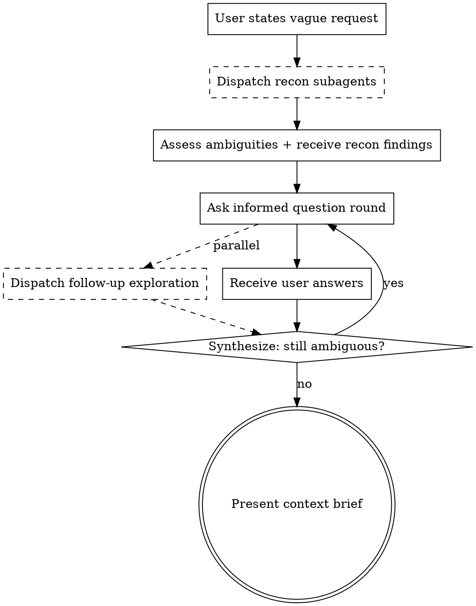

# Clarification Through Iterative Discovery

Narrows vague user requests into well-defined work scopes. Explores the codebase first, then asks questions grounded in what exploration found, iterating until ambiguity is gone.

## Core Principle

Ambiguity does not resolve in one pass. Multiple rounds of exploration and questions intersect, gradually sharpening the picture. Exploration comes first: an agent that has seen the codebase asks confident, specific questions; an agent that hasn't asks generic ones and wastes the user's answers. The purpose of this skill is not "writing code" — it is making "what the user wants" and "what state the codebase is in" vivid and clear.

## Hard Gates

1. **Explore before you ask.** Dispatch recon subagents BEFORE the first question. Every question must be grounded in exploration findings — never ask the user something the codebase can answer.
2. **Always use subagents.** Dispatch subagents before the first question, and again in response to the user's answers.
3. **Do not start implementation until you can say "this is clear enough."** Understanding must be complete at the codebase level.
4. **Every question must narrow scope.** Do not repeat questions at the same level of ambiguity. Independent questions may be bundled into one round (up to 4, e.g., via AskUserQuestion); dependent questions are asked iteratively. The loop ends when ambiguity is gone — not after a fixed number of rounds.
5. **Never dump raw code exploration results on the user.** Summarize findings in the context of the user's question.

## When To Use

- The user says "I want to…" but the scope is unclear
- The request is vague enough that implementation could go in multiple directions
- The user themselves hasn't fully articulated what they want
- There's a risk of clashing with existing codebase structure, so exploration is needed

## When NOT To Use

- The request is already specific and clear (proceed to implementation or plan skill)
- The scope is obvious, like a simple bug fix or config change
- The user explicitly says "don't ask questions, just do it"

## The Process: Recon First, Then the Q&A Loop

### Phase 0: Initial Recon (before any question)

On receiving the vague request, dispatch Explore subagent(s) immediately — before asking the user anything. The recon maps the territory the request likely touches: file structure, existing patterns, interface boundaries, recent related changes, test coverage.

While recon runs, analyze the request and list its ambiguities. Compose the first question round only AFTER recon returns, so every question can cite what the code actually looks like: "The codebase already handles X in `services/y.ts` — should this follow that pattern or replace it?"

### Track 1: User Q&A (Ambiguity Resolution)

Ask the user questions to resolve ambiguity.

**Question principles:**

- Ground every question in exploration findings — cite what was found
- Bundle independent questions into one round (up to 4); ask dependent questions iteratively
- Offer choices when possible (A/B/C)
- When a new ambiguity emerges from an answer, drill into it in the next round
- Ask "which case?" rather than "why?" — draw out concrete scenarios, not abstract intent
- If an answer contradicts a previous one, flag it immediately and realign

**Question sequence guide:**

1. **Purpose**: "What is the end goal of this work?" (what they want to achieve)
2. **Scope**: "What's included and what's excluded?" (draw boundaries)
3. **Constraints**: "Are there existing constraints that affect this?" (time, compatibility, dependencies)
4. **Success criteria**: "What should the state look like when this is done?" (verifiable outcome)
5. **Priority**: "If there are multiple paths, what matters most?" (trade-offs)

After each question, briefly update "what we've established so far."

### Track 2: Codebase Exploration (Technical Context)

Exploration starts before the first question (Phase 0) and continues between rounds — each user answer typically opens a new area worth exploring.

**How to dispatch exploration:**

Launch follow-up subagents as soon as an answer (or a prior finding) opens a new area — typically right after posing the next question round, so exploration runs while the user is answering. The subagent investigates:

- Related file structure and naming conventions
- Existing implementation patterns (error handling, state management, data flow)
- Dependencies and interface boundaries
- Recent change history (relevant commits)
- Test coverage status

**Subagent prompt template:**

```
subagent_type: Explore
description: "Explore [topic] codebase"
prompt: |
  The user has requested [summarized request].

  Investigate and report on:
  1. Related files and the role of each
  2. Existing implementation patterns (is something similar already in place?)
  3. Boundary areas this work is likely to affect
  4. Recent related changes
  5. Existing test state

  Report only key findings concisely.
  Do not dump entire file contents.
```

**Processing subagent results:**

When the subagent returns findings:
1. Cross-validate against the user's answers
2. If technical constraints unknown to the user are discovered, reflect them in the next question
3. If a conflict with existing code is likely, notify the user

## Putting It Together: The Loop


```dot
digraph clarification {
    rankdir=TB;
    "User states vague request" [shape=box];
    "Dispatch recon subagents" [shape=box, style=dashed];
    "Assess ambiguities + receive recon findings" [shape=box];
    "Ask informed question round" [shape=box];
    "Dispatch follow-up exploration" [shape=box, style=dashed];
    "Receive user answers" [shape=box];
    "Synthesize: still ambiguous?" [shape=diamond];
    "Present context brief" [shape=doublecircle];

    "User states vague request" -> "Dispatch recon subagents";
    "Dispatch recon subagents" -> "Assess ambiguities + receive recon findings";
    "Assess ambiguities + receive recon findings" -> "Ask informed question round";
    "Ask informed question round" -> "Dispatch follow-up exploration" [style=dashed, label="parallel"];
    "Ask informed question round" -> "Receive user answers";
    "Dispatch follow-up exploration" -> "Synthesize: still ambiguous?" [style=dashed];
    "Receive user answers" -> "Synthesize: still ambiguous?";
    "Synthesize: still ambiguous?" -> "Ask informed question round" [label="yes"];
    "Synthesize: still ambiguous?" -> "Present context brief" [label="no"];
}
```

**Each cycle:**

1. Receive the user's answers
2. Merge subagent results if available (if still in progress, merge in the next cycle)
3. Update the "remaining ambiguities" list
4. Compose the next question round (prioritize what most affects scope; bundle only independent questions)
5. If needed, launch additional subagents (when answers or previous exploration revealed new areas to investigate)

## Output: Context Brief

When ambiguity is sufficiently resolved, present the user with a Context Brief. This is the skill's final deliverable.

**Context Brief format:**

```markdown
## Context Brief: [Task Title]

### Goal
[One-sentence task goal]

### Scope
- **In scope**: [Included work]
- **Out of scope**: [Explicitly excluded work]

### Technical Context
[Technical facts discovered through code exploration]
- Current implementation state
- Affected areas
- Existing patterns to follow

### Constraints
[Identified constraints]
- External constraints
- Technical constraints
- Time/priority constraints

### Success Criteria
[Specific criteria for the completed state]

### Open Questions (if any)
[Questions still open — unresolved but not blocking]

### Complexity Assessment

Assess task complexity using these 5 signals. Score each signal, then determine the routing.

| Signal | Low (1) | Medium (2) | High (3) |
|--------|---------|-----------|----------|
| **Scope breadth** | Single feature or component | 2-3 related components | 4+ components or cross-cutting concerns |
| **File impact** | ≤3 files | 4-8 files | 9+ files or across 3+ directories |
| **Interface boundaries** | Works within existing interfaces | Extends existing interfaces | Defines new interfaces or modifies contracts |
| **Dependency depth** | No ordering constraints | Linear dependency chain | Branching dependencies requiring DAG |
| **Risk surface** | No integration risk | Internal integration between components | External systems, schema changes, backward compatibility |

**Score:** [sum of signals, range 5-15]
**Verdict:** [Simple (5-8) | Borderline (9) | Complex (10-15)]
**Rationale:** [1-2 sentences explaining the dominant complexity factor]

### Suggested Next Step
[Auto-determined by Complexity Assessment verdict — see Routing Rules below]
```

**Save the Context Brief to a file:**

```
docs/engineering-discipline/context/YYYY-MM-DD-<topic>-brief.md
```

(사용자가 다른 위치를 지정하면 해당 위치를 따른다.)

대화에 먼저 Context Brief를 보여주고, 사용자가 승인하면 파일로 저장한다. 이 파일은 `plan-crafting` 스킬의 입력으로 직접 사용된다.

## Red Flags

Stop and recalibrate if any of these occur:

| Situation | Response |
|-----------|----------|
| User says "just figure it out" | Warn: starting before ambiguity is resolved leads to a high probability of rework. At minimum, confirm purpose and success criteria |
| Same topic questioned 3+ times | The user genuinely doesn't know. Separate knowns from unknowns, present assumptions for the unknowns, and confirm |
| Subagent finds conflicting existing code | Notify the user immediately. Conflicts with existing structure require a design decision |
| Request decomposes into multiple independent sub-tasks | Show the decomposition to the user and propose prioritizing one at a time |

## Anti-Patterns

| Anti-Pattern | Why It Fails |
|--------------|-------------|
| Asking the first question before recon returns | Generic questions the codebase could have answered; wastes the user's time and confidence |
| Bundling dependent questions in one round | Later answers invalidate the earlier ones in the same batch |
| Questions without code exploration | Scope can narrow in a direction that conflicts with existing code |
| Showing full subagent output to the user | Too much noise. Provide only the summary relevant to the user's context |
| Deciding "that's enough" unilaterally | Always present the Context Brief to the user and get confirmation |
| Starting implementation | This skill ends at "clear context," not "implemented code" |

## Minimal Checklist

Self-check at the end of each cycle:

- [ ] Did at least one ambiguity get resolved this cycle?
- [ ] Is subagent exploration in progress or complete?
- [ ] Is the next question round grounded in both previous answers and exploration findings?
- [ ] Has progress been clearly communicated to the user?

## Routing Rules

After the Context Brief is approved, the **Complexity Assessment verdict** determines the next skill:

| Verdict | Route | Rationale |
|---------|-------|-----------|
| **Simple** (score 5-8) | `plan-crafting` | Task fits in a single plan cycle. Direct planning is sufficient. |
| **Borderline** (score 9) | User decides | Present both options with a recommendation. |
| **Complex** (score 10-15) | `milestone-planning` | Task requires multiple plan cycles. Milestone decomposition needed before planning. |

**Override:** The user can always override the routing. If the user says "just plan it" for a complex task, route to `plan-crafting`. If the user says "break it into milestones" for a simple task, route to `milestone-planning`.

**Borderline (score 9):** Present both options to the user with a recommendation. Example: "This scores 9 — borderline. I recommend milestone-planning because [dominant factor], but plan-crafting could work if [condition]. Which do you prefer?"

The "Suggested Next Step" field in the Context Brief must reflect this routing:

- Simple (5-8): "Proceed to `plan-crafting` — task fits in a single plan cycle."
- Borderline (9): "Recommend [route] because [dominant factor], but [other route] is viable if [condition]. User choice needed."
- Complex (10-15): "Proceed to `milestone-planning` — task requires milestone decomposition for multi-phase execution."

## Transition

Once the Context Brief is approved by the user, route based on the Complexity Assessment:

- **Simple** (score 5-8) → `plan-crafting` skill — single-cycle implementation planning
- **Borderline** (score 9) → present both options with recommendation, user decides
- **Complex** (score 10-15) → `milestone-planning` skill — multi-phase milestone decomposition, then `long-run` for execution
- If further exploration is needed → `clarification` 스킬 자체의 Q&A 루프 계속
- If the scope is already trivial and planning is unnecessary → direct implementation

This skill itself **does not invoke the next skill.** It ends by presenting the Context Brief, saving it to a file, and suggesting the routed next step.

**Context Brief → plan-crafting 매핑:**

| Context Brief 필드 | plan-crafting 입력 |
|---|---|
| Goal | 계획 헤더의 "목표" |
| Scope (In/Out) | 계획 헤더의 "작업 범위" |
| Technical Context | "아키텍처" + "기술 스택" + 파일 구조 매핑의 기반 |
| Constraints | 태스크 분해 시 제약사항 반영 |
| Success Criteria | Self-Review 기준 |
| Open Questions | 계획에 가정(assumption)으로 반영 후 사용자 확인 |
