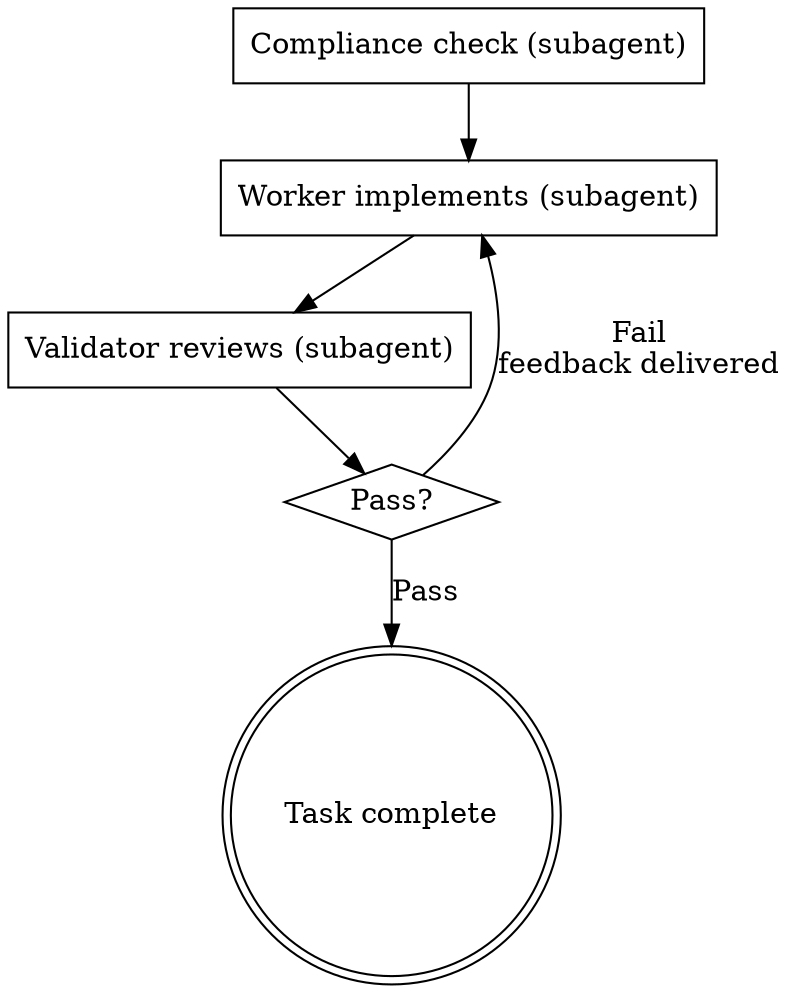

# Run Plan

Loads a written plan document, reviews it critically, then executes tasks in dependency order using a worker-validator loop.

## Core Principle

Do not follow plans blindly. If the plan has issues, flag them before executing. But if the plan is clear, execute it faithfully.

## Hard Gates

1. **Read and review the plan first.** Always review the entire plan before executing.
2. **Follow steps exactly.** Do not skip or alter steps in the plan arbitrarily.
3. **Never skip verification.** Test runs, expected output checks, and other verifications stated in the plan must be performed.
4. **Parallelizable tasks must always run in parallel.** Tasks with no dependencies and no shared file modifications must be dispatched concurrently. Sequential grouping is prohibited.
5. **Worker and Validator must be separate subagents.** The main agent must NOT perform worker or validator roles inline. Each must be dispatched as an independent subagent via the Agent tool.
6. **Validator must not receive worker output.** The validator subagent receives only the plan's task goal and acceptance criteria. It must never receive the worker's diff, logs, or implementation details. The validator judges by reading the code and running tests independently.
7. **Stop when blocked.** Do not guess. Ask the user.

## When To Use

- After a plan has been crafted with the `plan-crafting` skill
- When the user says "run this plan" or "execute the plan"
- When a plan document exists and implementation should begin

## When NOT To Use

- When no plan document exists yet (use `plan-crafting` first)
- When work scope is still ambiguous (return to the `clarification` skill)
- Single-step tasks that don't need a plan

## Process

### Step 1: Load and Review Plan

1. Read the plan file
2. Review critically:
   - Are task dependencies correct?
   - Do file paths exist?
   - Are there any placeholders in steps?
   - Is anything unclear?
3. If issues found: notify the user before starting
4. If no issues: create tasks via TaskCreate and proceed

### Step 2: Task Execution Loop

Each task runs through a **Compliance Check → Worker Implementation → Validator Review** cycle. If the validator rejects, feedback is sent back to the worker for re-implementation.



For each task, perform the following cycle:

**2-1. Compliance Check (subagent)**

Before starting a task, verify that the current task aligns with the plan:

- Compare the plan's defined steps against current file state
- Confirm that predecessor tasks' outputs exist as expected
- Verify that all dependency tasks have completed
- Confirm no other task modifying the same file is in progress

If issues found: notify the user and resolve before proceeding.

**2-2. Worker Implementation (subagent, via Agent tool)**

Dispatch a subagent (worker) via the Agent tool to execute the task's steps:

- The worker follows the steps exactly as written in the plan
- The worker makes no arbitrary judgments beyond what the plan specifies
- The worker performs each step's verification (test runs, etc.)
- The worker reports results back to the main agent
- The main agent must NOT perform the worker's role inline — always spawn a subagent

**2-3. Validator Review (subagent, via Agent tool — information-isolated)**

Dispatch a separate subagent (validator) via the Agent tool. The validator operates under an **information barrier** — it knows only what the task was supposed to accomplish, not what the worker did or how.

**Constructing the validator prompt:**

The main agent must NOT compose the validator prompt freely. Use the fixed template below, filling only the four designated fields by copying verbatim from the plan document. Do not paraphrase, summarize, or add context beyond what the template specifies.

```
You are an independent validator. You have no knowledge of how this task
was implemented. Your job is to judge whether the codebase currently meets
the goal described below, by reading files and running tests yourself.

## Task Goal

{TASK_GOAL}
— Copy the task's goal statement verbatim from the plan.

## Acceptance Criteria

{ACCEPTANCE_CRITERIA}
— Copy the task's acceptance criteria verbatim from the plan.
  Each criterion is a concrete, verifiable condition.

## Files To Inspect

{FILE_LIST}
— Copy the list of files this task is expected to create or modify,
  as listed in the plan.

## Test Commands

{TEST_COMMANDS}
— Copy any test execution commands or verification steps
  specified in the plan for this task.

## Your Review Process

1. Read each file in the file list directly from disk.
2. For each acceptance criterion, determine whether it is met
   based on what you see in the code. Record PASS or FAIL per criterion.
3. Run every test command listed above. Record results.
4. Run the full test suite to check for regressions.
5. Check for residual issues: placeholder code (TODO, FIXME, stubs),
   debug code (console.log, print statements), commented-out blocks.

## Your Output

Report your verdict as PASS or FAIL.

- If PASS: confirm which criteria were verified and which tests passed.
- If FAIL: list exactly which criteria failed and why, with file paths
  and line numbers. Do not suggest fixes — only describe what is wrong.
```

**What must NOT appear in the validator prompt:**
- The worker's diff, logs, output, or return message
- The worker's implementation approach or strategy
- Any paraphrasing or summarization by the main agent — only verbatim plan content fills the template
- Framing language that hints at the worker's approach (e.g., "check if the refactoring was done correctly" leaks that a refactoring was performed)

**Why a fixed template:** The main agent has seen the worker's output and may unconsciously frame the validator's task in terms of what the worker did. A fixed template eliminates this channel — the validator sees only the plan's original specification, not the main agent's post-worker understanding.

**Validation results:**
- **Pass:** Mark the task as completed and move to the next task
- **Fail:** Deliver the validator's feedback to the worker and return to step 2-2 for re-implementation. The feedback is the validator's own assessment — do not augment it with the main agent's interpretation.

**Retry limit:** If the same task fails 3 consecutive times, report the situation to the user and request intervention.

**Parallel Execution Rules (Hard Gate #4):**

Tasks that can run in parallel **must** be dispatched in parallel. Grouping them sequentially is prohibited.

Parallel execution conditions (all must be met):
- No dependencies on other tasks
- No modifications to the same file
- No changes to shared state (DB schema, config files, etc.)

When running in parallel:
- Dispatch an independent "worker subagent" for each task
- After each worker completes, dispatch an independent "validator subagent" for review
- After all parallel tasks complete, aggregate results before proceeding to the next dependent task

Sequential execution required for:
- Tasks with explicit dependencies (run after predecessor completes)
- Tasks modifying the same file (must run sequentially)

### Step 3: Full Verification

After all tasks are complete:

1. Run the full test suite
2. Confirm the plan's goals have been met
3. Report a summary of results to the user

## When To Stop

**Stop executing immediately and ask the user for help when:**

- A blocker occurs (missing dependency, test fails, instruction unclear)
- The plan has critical gaps preventing execution
- You don't understand an instruction
- Verification fails repeatedly

**Ask for clarification rather than guessing.**

## Validator Checklist

After each task completion, verify:

- [ ] Did the tests pass?
- [ ] Were the specified files created/modified correctly?
- [ ] Does the code match what was specified in the steps?
- [ ] Was the commit created correctly?

## Anti-Patterns

| Anti-Pattern | Why It Fails |
|---|---|
| Executing without reviewing the plan | Plan errors propagate into implementation |
| Skipping verification steps | Errors accumulate, debugging cost increases later |
| Guessing when blocked | Spec drift, rework required |
| Running non-parallelizable tasks in parallel | File conflicts, dependency tangles |
| Running parallelizable tasks sequentially | Wasted time, unnecessary execution delay |
| Main agent performing worker/validator roles inline | Defeats independent verification; confirmation bias |
| Passing worker output to the validator | Validator anchors on worker's framing instead of judging independently |
| Composing the validator prompt freely instead of using the fixed template | Main agent unconsciously leaks worker context through word choice and framing |
| Paraphrasing the plan instead of copying verbatim into the template | Paraphrasing filters through the main agent's post-worker understanding, introducing bias |
| Starting implementation on main/master without explicit user consent | Prohibited without explicit approval |

## Transition

After plan execution is complete:

- To wrap up the work branch → report results to the user and suggest next steps
- If independent verification is needed → suggest transitioning to the `review-work` skill
- If ambiguity is discovered during execution → return to the `clarification` skill to resolve
- If the plan itself needs modification → return to the `plan-crafting` skill to revise

This skill itself **does not invoke the next skill.** It ends by reporting execution results and letting the user choose the next step.
