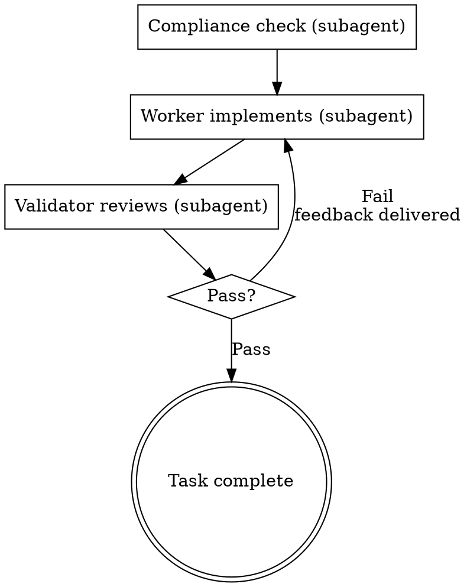

# Run Plan

Loads a written plan document, reviews it critically, then executes tasks in dependency order using a worker-validator loop.

## Core Principle

Do not follow plans blindly. If the plan has issues, flag them before executing. But if the plan is clear, execute it faithfully.

## Hard Gates

1. **Read and review the plan first.** Always review the entire plan before executing.
2. **Criteria are binding; steps are the route.** Never skip a task or alter its Acceptance Criteria. Steps are followed as written when they match reality — when reality contradicts a step (stale anchor, renamed symbol, changed API), the worker adapts minimally to satisfy the criteria and reports the deviation. Silent deviation is prohibited; so is failing a task because the plan's route was stale.
3. **Never skip verification.** Test runs, expected output checks, and other verifications stated in the plan must be performed.
4. **Parallelizable tasks must always run in parallel.** Tasks with no dependencies and no shared file modifications must be dispatched concurrently. Sequential grouping is prohibited.
5. **Worker and Validator must be separate subagents.** The main agent must NOT perform worker or validator roles inline. Each must be dispatched as an independent subagent via the Agent tool.
6. **Validator must not receive worker output.** The validator subagent receives only the plan's task goal and acceptance criteria. It must never receive the worker's diff, logs, or implementation details. The validator judges by reading the code and running tests independently.
7. **Stop when blocked.** Do not guess. Ask the user.

## When To Use

- After a plan has been crafted with the `plan-crafting` skill
- When the user says "run this plan" or "execute the plan"
- When a plan document exists and implementation should begin

## When NOT To Use

- When no plan document exists yet (use `plan-crafting` first)
- When work scope is still ambiguous (return to the `clarification` skill)
- Single-step tasks that don't need a plan

## Process

### Step 0: Project Capability Discovery

Before reviewing the plan, discover what the project offers for verification and execution:

1. **Verification infrastructure** — read the plan's `Verification Strategy` header. If present, use it. If absent, run the same discovery as plan-crafting:
   - e2e tests → integration tests → verification skills/agents → test suite → build+lint
   - Record the discovered command for use in the E2E Gate (Step 3)

2. **Available agents and skills** — scan for project-level agents (`.claude/agents/`), plugin agents, and project skills (`.claude/skills/`) that workers can leverage. If the plan references specific agents in task steps, verify they exist before execution begins.

3. **If an agent/skill is referenced but missing:** Notify the user. Do not block execution — workers can execute steps directly without the agent.

### Step 1: Load and Review Plan

1. Read the plan file
2. Review critically:
   - Are task dependencies correct?
   - Do file paths exist?
   - Are there any placeholders in steps?
   - Does every task have a Goal and binary-decidable Acceptance Criteria? (If not, the validator contract cannot be filled — return to `plan-crafting`)
   - Is anything unclear?
3. If issues found: notify the user before starting
4. If no issues: create tasks via TaskCreate and proceed

### Step 2: Task Execution Loop

Each task runs through a **Compliance Check → Worker Implementation → Validator Review** cycle. If the validator rejects, feedback is sent back to the worker for re-implementation.


```dot
digraph task_loop {
    rankdir=TB;
    "Compliance check (subagent)" [shape=box];
    "Worker implements (subagent)" [shape=box];
    "Validator reviews (subagent)" [shape=box];
    "Pass?" [shape=diamond];
    "Task complete" [shape=doublecircle];

    "Compliance check (subagent)" -> "Worker implements (subagent)";
    "Worker implements (subagent)" -> "Validator reviews (subagent)";
    "Validator reviews (subagent)" -> "Pass?";
    "Pass?" -> "Task complete" [label="Pass"];
    "Pass?" -> "Worker implements (subagent)" [label="Fail\nfeedback delivered"];
}
```

For each task, perform the following cycle:

**2-1. Compliance Check (subagent)**

Before starting a task, verify that the current task aligns with the plan:

- Compare the plan's defined steps against current file state
- Confirm that predecessor tasks' outputs exist as expected
- Verify that all dependency tasks have completed
- Confirm no other task modifying the same file is in progress

If issues found: notify the user and resolve before proceeding.

**2-2. Worker Implementation (subagent, via Agent tool)**

Dispatch a subagent (worker) via the Agent tool to execute the task's steps:

- The worker follows the steps as written when they match the actual codebase
- **Bounded adaptation:** when a step contradicts reality (stale anchor, renamed symbol, API shape differs from the plan's code block), the worker makes the smallest change of route that still satisfies the task's Goal and Acceptance Criteria, and records the deviation in its report
- **Adaptation limits — stop and report to the main agent instead of adapting when the fix would:** change an interface another task consumes, touch files outside the task's Files list, or alter an acceptance criterion. These are plan defects, not route noise — the main agent handles them via the Plan Amendment Protocol (see 2-3)
- The worker performs each step's verification (test runs, etc.)
- **If the plan references a project agent or skill for a step**, the worker should use it via the Agent tool or Skill tool. If the agent/skill is unavailable, execute the step directly.
- The worker reports results back to the main agent
- The main agent must NOT perform the worker's role inline — always spawn a subagent

**2-3. Validator Review (subagent, via Agent tool — information-isolated)**

Dispatch a separate subagent (validator) via the Agent tool. The validator operates under an **information barrier** — it knows only what the task was supposed to accomplish, not what the worker did or how.

**Constructing the validator prompt:**

The main agent must NOT compose the validator prompt freely. Use the fixed template below, filling only the four designated fields by copying verbatim from the plan document. Do not paraphrase, summarize, or add context beyond what the template specifies.

```
You are an independent validator. You have no knowledge of how this task
was implemented. Your job is to judge whether the codebase currently meets
the goal described below, by reading files and running tests yourself.

## Task Goal

{TASK_GOAL}
— Copy the task's goal statement verbatim from the plan.

## Acceptance Criteria

{ACCEPTANCE_CRITERIA}
— Copy the task's acceptance criteria verbatim from the plan.
  Each criterion is a concrete, verifiable condition.

## Files To Inspect

{FILE_LIST}
— Copy the list of files this task is expected to create or modify,
  as listed in the plan.

## Test Commands

{TEST_COMMANDS}
— Copy any test execution commands or verification steps
  specified in the plan for this task.

## Your Review Process

1. Read each file in the file list directly from disk.
2. For each acceptance criterion, determine whether it is met
   based on what you see in the code. Record PASS or FAIL per criterion —
   binary only, no "partially met".
3. Run every test command listed above. Record results.
4. Note (do not judge) residual issues you happen to see: placeholder
   code (TODO, FIXME, stubs), debug code, commented-out blocks.

## Your Output

Verdict = AND of all acceptance criteria and listed tests.
PASS only if every criterion is met and every listed test passes.
Anything less is FAIL — no partial credit, no "close enough".

- If PASS: confirm which criteria were verified and which tests passed.
- If FAIL: list exactly which criteria failed and why, with file paths
  and line numbers. Do not suggest fixes — only describe what is wrong.
- Residual issues from step 4 are advisory findings appended to the
  report. They do not affect the verdict.
```

**Verification layer separation:** the validator judges only this task's contract — its Acceptance Criteria and listed test commands. It does NOT run the full test suite; cross-task regression checking happens exactly once, at the E2E Verification Gate (Step 3), not N times per task.

**What must NOT appear in the validator prompt:**
- The worker's diff, logs, output, or return message
- The worker's implementation approach or strategy
- Any paraphrasing or summarization by the main agent — only verbatim plan content fills the template
- Framing language that hints at the worker's approach (e.g., "check if the refactoring was done correctly" leaks that a refactoring was performed)

**Why a fixed template:** The main agent has seen the worker's output and may unconsciously frame the validator's task in terms of what the worker did. A fixed template eliminates this channel — the validator sees only the plan's original specification, not the main agent's post-worker understanding.

**Validation results:**
- **Pass:** Mark the task as completed and move to the next task
- **Fail — triage before retrying.** Classify the failure first:
  - **Worker defect** — the plan is right, the code doesn't meet it: deliver the validator's feedback to the worker and return to step 2-2 for re-implementation. The feedback is the validator's own assessment — do not augment it with the main agent's interpretation. On second and later retries, deliver ALL prior validator feedback for this task (accumulated, verbatim), not only the latest — repeated failures often share a root cause visible only across attempts.
  - **Plan defect** — the code cannot meet the plan as written: an impossible route, a dependency the plan missed, an interface the plan got wrong, a criterion that contradicts verified codebase reality. Do NOT retry the worker against a broken plan — invoke the Plan Amendment Protocol below.

**Retry limit:** If the same task fails 3 consecutive times (worker retries and amendments combined), report the situation to the user and request intervention.

**Plan Amendment Protocol (plan-defect failures):**

Triggered when triage classifies a failure as a plan defect, or when a worker stops at its adaptation limits.

1. **Diagnose against the codebase.** Read the actual state that contradicts the plan; identify exactly which task fields (steps, files, dependency, criterion) are wrong.
2. **Amend the plan document itself** — the affected task(s) only, staying within the plan's Goal and Work Scope. Append an entry to a `## Plan Amendment Log` section at the bottom of the plan file: what changed, why, and which task's failure triggered it. Amendments live in the file, not in conversation memory — later tasks' compliance checks and review-work both read the plan file, so an unamended file means drift.
3. **Criteria guard (anti-gaming):** an acceptance criterion may be corrected only when it is factually stale (renamed command, moved file) — the corrected criterion must verify the SAME outcome as the original. NEVER weaken, loosen, or delete a criterion because the implementation fails it — that is reward hacking, and the binary verdict exists precisely to catch it. If a criterion seems genuinely wrong about the goal itself, escalate to the user: that is a scope decision, not an amendment.
4. **Re-run the compliance check (2-1), then dispatch a fresh worker** against the amended task.
5. An amendment counts toward the task's 3-attempt limit. A task needing repeated amendments is a planning failure — escalate rather than amending a third time.

**Parallel Execution Rules (Hard Gate #4):**

Tasks that can run in parallel **must** be dispatched in parallel. Grouping them sequentially is prohibited.

Parallel execution conditions (all must be met):
- No dependencies on other tasks
- No modifications to the same file
- No changes to shared state (DB schema, config files, etc.)

When running in parallel:
- Dispatch an independent "worker subagent" for each task
- After each worker completes, dispatch an independent "validator subagent" for review
- After all parallel tasks complete, aggregate results before proceeding to the next dependent task

**Commit protocol for parallel tasks:** Workers dispatched in parallel do NOT execute their task's commit step — concurrent `git add`/`git commit` in a shared working tree race on the git index and can interleave staging across tasks. Instead, after each task's validator passes, the main agent stages exactly that task's files (from the plan's Files list) and creates that task's commit, sequentially. Sequentially-executed tasks commit as written in the plan.

Sequential execution required for:
- Tasks with explicit dependencies (run after predecessor completes)
- Tasks modifying the same file (must run sequentially)

### Step 3: E2E Verification Gate

After all tasks are complete (including the Final Verification Task if present), run the highest-level verification as an independent gate:

1. **Run the discovered verification command** from Step 0 (or the plan's Verification Strategy)
2. **Run the full test suite** for regression check
3. **Verify all plan success criteria** are met

**If all pass:** Report success summary to the user.

**If E2E verification fails — Failure Response Protocol:**

The E2E gate failure means individual tasks passed their validators but the system as a whole doesn't work. This is an integration problem, not a task-level problem.

1. **Diagnose (attempt 1):**
   - Read the failure output carefully
   - Identify which tasks' interactions likely caused the failure
   - Dispatch a worker subagent to apply a targeted fix (scoped to the diagnosed interaction)
   - Re-run the E2E verification command

2. **Re-diagnose (attempt 2):**
   - If the targeted fix didn't resolve it, re-read the failure output
   - Check for a different root cause (the first diagnosis may have been wrong)
   - Apply a second targeted fix
   - Re-run the E2E verification command

3. **Escalate to user (after 2 failed attempts):**
   - Report: what the E2E verification tests, what failed, what fixes were attempted, and the current hypothesis
   - Let the user decide: continue debugging, re-plan specific tasks, or accept partial completion
   - Do NOT keep retrying silently — 2 attempts is the limit before escalation

## When To Stop

**Stop executing immediately and ask the user for help when:**

- A blocker occurs (missing dependency, test fails, instruction unclear)
- The plan has critical gaps preventing execution
- You don't understand an instruction
- Verification fails repeatedly

**Ask for clarification rather than guessing.**

## Validator Checklist

After each task completion, verify:

- [ ] Is every acceptance criterion met? (binary per criterion — verdict is the AND)
- [ ] Did the task's listed test commands pass?
- [ ] Were the specified files created/modified?
- [ ] Was the commit created? (by the worker, or by the main agent for parallel tasks)

The validator does NOT check whether the code matches the plan's steps literally — the worker may have adapted the route. The criteria are the contract.

## Anti-Patterns

| Anti-Pattern | Why It Fails |
|---|---|
| Executing without reviewing the plan | Plan errors propagate into implementation |
| Skipping verification steps | Errors accumulate, debugging cost increases later |
| Guessing when blocked | Spec drift, rework required |
| Running non-parallelizable tasks in parallel | File conflicts, dependency tangles |
| Running parallelizable tasks sequentially | Wasted time, unnecessary execution delay |
| Parallel workers each running `git commit` | Git index race; interleaved staging mixes tasks into one commit |
| Worker failing a task because a line anchor was stale | Criteria are the contract, not the route; adapt and report instead |
| Worker silently deviating from the plan without reporting | Main agent loses the audit trail; validator may pass code the plan never intended |
| Validator running the full test suite per task | N redundant suite runs; regression checking belongs to the E2E gate, once |
| Retrying the worker against a plan-defect failure | Burns the retry budget on an impossible task; triage first, amend the plan |
| Weakening an acceptance criterion so a failing implementation passes | Reward hacking — the binary verdict exists to catch this, not to be bent around it |
| Amending the plan in conversation only, not in the plan file | Later compliance checks and review-work read the file; an unamended file means silent drift |
| Main agent performing worker/validator roles inline | Defeats independent verification; confirmation bias |
| Passing worker output to the validator | Validator anchors on worker's framing instead of judging independently |
| Composing the validator prompt freely instead of using the fixed template | Main agent unconsciously leaks worker context through word choice and framing |
| Paraphrasing the plan instead of copying verbatim into the template | Paraphrasing filters through the main agent's post-worker understanding, introducing bias |
| Starting implementation on main/master without explicit user consent | Prohibited without explicit approval |
| Skipping the E2E gate because individual tasks all passed | Task-level pass ≠ system-level pass; integration bugs hide between tasks |
| Retrying E2E failures more than twice without user escalation | Wastes budget; user may have context about the root cause |

## Transition

After plan execution is complete:

- To wrap up the work branch → report results to the user and suggest next steps
- If independent verification is needed → suggest transitioning to the `review-work` skill
- If ambiguity is discovered during execution → return to the `clarification` skill to resolve
- If the plan itself needs modification → return to the `plan-crafting` skill to revise

This skill itself **does not invoke the next skill.** It ends by reporting execution results and letting the user choose the next step.
